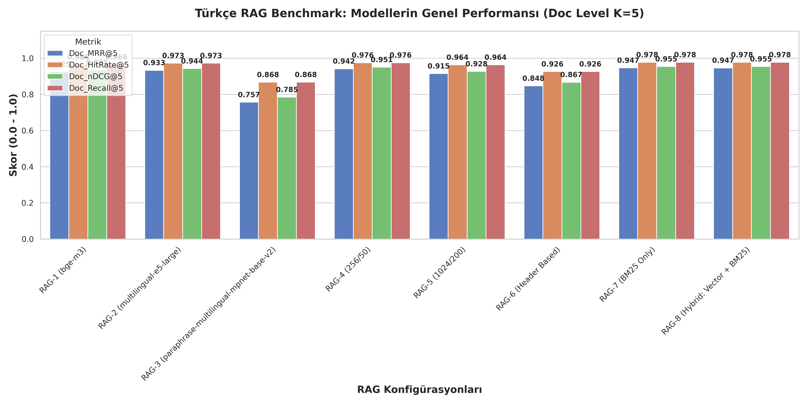
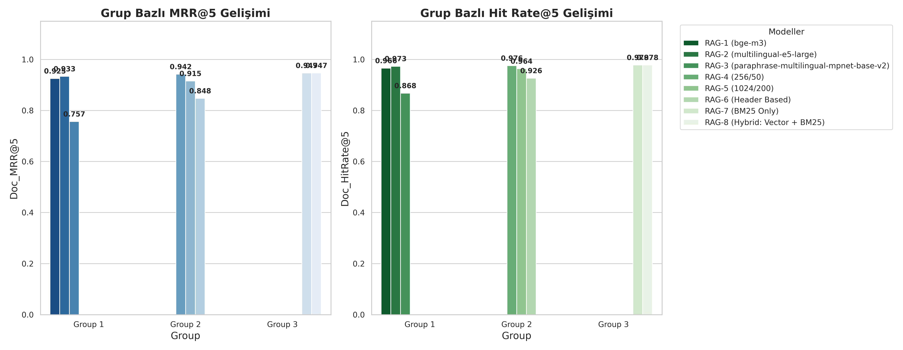
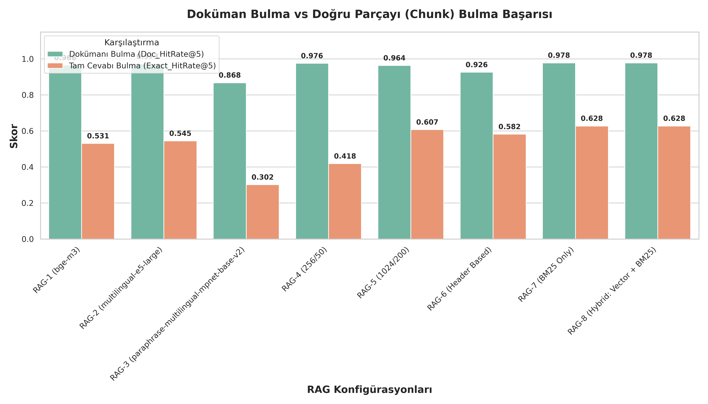
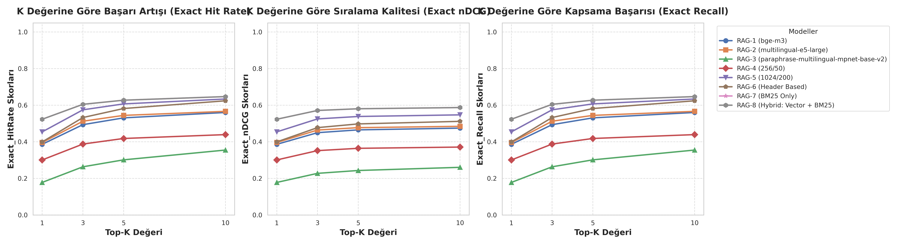

# 🇹🇷 Turkish RAG Benchmark
> **Türkçe Akademik Metinler İçin RAG Benchmark Veri Seti ve Performans Değerlendirmesi**

[](https://www.llamaindex.ai/)
[](https://www.python.org/)
[](https://developer.nvidia.com/cuda-zone)
[](https://github.com/DS4SD/docling)

Bu proje, Türkçe akademik ve teknik dokümanlar üzerinde en doğru ve kararlı **RAG (Retrieval-Augmented Generation)** mimarisini bulmak amacıyla tasarlanmış uçtan uca bir benchmark çalışmasıdır. Proje kapsamında, ham akademik PDF dosyalarının yüksek doğrulukla metne dönüştürülmesinden,  LLM'ler ile sentetik test seti (Soru-Cevap) üretimine ve LlamaIndex kullanılarak farklı yerleştirme (embedding), bölümleme (chunking) ve geri getirme (retrieval) stratejilerinin GPU tabanlı performans testlerine kadar tüm süreçler analiz edilmiştir. Çalışmada kullanılan değerlendirme veri seti, **235 akademik makale** ve bu makalelerden üretilmiş **2132 doğrulanmış soru-cevap çiftinden** oluşmaktadır.


---

## 🎯 Projenin Amacı 


Bu projeyle, heterojen akademik disiplinlerden veriler derlenerek, **Türkçe RAG sistemleri için en ideal tasarım şablonunu (best practices) belirlemek** ve geliştiricilere somut metriklerle rehberlik etmek hedeflenmiştir.

---

## 🚀 İş Akışı 

Proje, birbirini takip eden **4 temel aşamadan** oluşmaktadır:


### 1. Veri Toplama (Raw Data Collection)
Farklı disiplinlerin terminolojik ve yapısal dinamiklerini yansıtmak amacıyla **5 ana akademik alandan** toplam **235 akademik makale** (PDF formatında) derlenmiştir:
*   🩺 **Tıp (Medicine):** Yoğun latince terimler ve karmaşık vaka analizleri.
*   💻 **ML-AI (Machine Learning):** İngilizce-Türkçe karışık teknik terimler, matematiksel formüller ve kod blokları.
*   ⚖️ **Sosyal Bilimler (Social Sciences):** Uzun paragraflar ve betimsel anlatım.
*   👥 **Sosyal Toplum Bilimleri (Social & Policy Sciences):** Mevzuatlar, anket verileri ve kurumsal dil.
*   📐 **Fizik-Matematik (Physics & Mathematics):** Formüller, semboller ve yoğun sayısal veri tabloları.

### 2. Doküman Dönüştürme (IBM Docling)
Ham PDF'lerin metne dönüştürülmesinde geleneksel araçlar yerine IBM Research tarafından geliştirilen **Docling (DocumentConverter)** kullanılmıştır. 
*   Docling, çok sütunlu sayfa tasarımlarını, görseller altındaki yazıları ve tabloları yapısal bütünlüğünü bozmadan **Markdown (MD)** formatına dönüştürmüştür.
*   Bu aşamada üretilen ham markdown dosyaları `data/processed/stage1_extracted/` dizininde saklanmıştır.

### 3. Metin Ön İşleme ve Temizleme (Text Cleaning)
Ham dönüştürme çıktısı üzerinde özel Regex filtreleri uygulanarak:
*   Tekrarlanan sayfa numaraları, başlık/dipnot bilgileri kaldırılmıştır.
*   Tablo formatları standardize edilmiş ve gereksiz boşluklar temizlenmiştir.
*   RAG sisteminin anlamsal arama başarımını doğrudan baltalayan "gürültü" veriler izole edilmiştir.
*   Temizlenmiş nihai MD dosyaları `data/processed/stage2_cleaned/` klasörüne aktarılmıştır.

### 4. Gelişmiş LLM'ler ile Sentetik Soru-Cevap Üretimi (QA Generation)
RAG değerlendirmesi için gereken yüksek kaliteli test kümesini oluşturmak amacıyla, temizlenen MD dosyaları kaynak gösterilerek gelişmiş LLM'ler kullanılmıştır:
*   **Kullanılan Modeller:** `Gemini 3.5 Flash (High)`, `Gemini 3.1 Pro (High)` ve `Claude Opus 4.6 (Thinking)`.
*   Her model, ilgili metin bölümlerinden (Özet, Giriş, Deneyler, Sonuç vb.) yola çıkarak **Soru-Cevap (QA) ve Kaynak Eşleşmesi (Ground Truth)** ikililerini türetmiştir.
*   Oluşturulan 5 farklı konu bazlı veri seti `data/benchmark/` altında toplanmış olup, toplamda **2132 soru-cevap çiftinden** oluşan zengin bir Türkçe benchmark veri seti elde edilmiştir.

---


## 📁 Proje Klasör Yapısı

```
turkish-rag-benchmark/
├── data/
│   ├── raw/                    # Orijinal ham PDF dosyaları (Tıp, ML-AI, Sosyal Bilimler vb.)
│   ├── processed/              # Metin dönüşüm aşamaları
│   │   ├── stage1_extracted/   # Docling çıktısı ham Markdown (.md) dosyaları
│   │   └── stage2_cleaned/     # Temizleme ve gürültüden arındırma sonrası Markdown (.md) dosyaları
│   └── benchmark/              # Sentetik Soru-Cevap test seti (JSON)
├── notebooks/                  # Deneysel Jupyter Notebook dosyaları
│   ├── extract_text.ipynb      # Docling ile PDF-to-MD dönüşüm betiği
│   └── benchmarks.ipynb        # LlamaIndex ile RAG testleri, Exact Match ve analizleri
├── results/                    # Değerlendirme Çıktıları
│   ├── figures/                # Performans ve gelişim grafikleri (.png)
│   │   ├── overall_performance.png
│   │   ├── progression_by_groups.png
│   │   ├── doc_vs_exact_hitrate.png
│   │   └── top_k_curve.png
│   └── tables/                 # Sistem bazlı metrik sonuçları (.csv)
└── README.md                   # Proje ana tanıtım dökümanı (Bu dosya)
```

---

## ⚙️ RAG Konfigürasyonları ve Test Mimarisi

Değerlendirmeler **LlamaIndex** framework'ü üzerinde, GPU (CUDA) hızlandırmasıyla yapılmıştır. Test edilen **8 RAG konfigürasyonu** 3 bağımsız grupta karşılaştırılmıştır:

### 📊 Karşılaştırma Grupları

#### **Grup 1: Yerleştirme (Embedding) Modelleri**
*Sabit Koşul: Bölüm boyutu (Chunk Size) = 512, Örtüşme (Overlap) = 128.*
*   **RAG-1 (bge-m3):** `BAAI/bge-m3` (Çok dilli ve hibrit destekli güçlü yerleştirme modeli)
*   **RAG-2 (multilingual-e5-large):** `intfloat/multilingual-e5-large` (Arama görevlerinde lider çok dilli model)
*   **RAG-3 (paraphrase-multilingual-mpnet-base-v2):** `sentence-transformers/paraphrase-multilingual-mpnet-base-v2` (Hafif ve hızlı anlamsal benzerlik modeli)

#### **Grup 2: Bölümleme (Chunk) Stratejileri**
*Sabit Koşul: En iyi performansı veren Grup 1 modeli (`multilingual-e5-large`) kullanılır.*
*   **RAG-4 (256/50):** Küçük parçalar halinde sabit boyutlu bölümleme (`SentenceSplitter`)
*   **RAG-5 (1024/200):** Geniş bağlamlı sabit boyutlu bölümleme (`SentenceSplitter`)
*   **RAG-6 (Header Based):** Markdown başlık yapılarını (`#`, `##`, `###`) temel alan anlamsal bölümleme (`MarkdownNodeParser`)

#### **Grup 3: Geri Getirme (Retrieval) Stratejileri**
*Sabit Koşul: En iyi performansı veren Grup 1 ve Grup 2 kombinasyonu temel alınır. (Exact Match başarımı en yüksek olan RAG-5 / Chunk 1024 temel alınmıştır).*
*   **RAG-7 (BM25 Only):** Geleneksel kelime eşleştirmeli arama (`BM25Retriever`)
*   **RAG-8 (Hybrid: Vector + BM25):** Vektörel arama ile BM25'i birleştiren melez arama yapısı (`QueryFusionRetriever`)

---

## 🏆 Deneysel Sonuçlar ve Performans Metrikleri

Modeller hem **Doküman Düzeyinde (Document-Level)** hem de **Tam Eşleşme/Parça Düzeyinde (Exact-Match Chunk-Level)** ikişer temel metrik üzerinden test edilmiştir:
1. **Doküman Düzeyi (Doc_HitRate & Doc_MRR):** Sorgunun türetildiği doğru makalenin (dokümanın) geri getirilen parçalar arasında yer alıp almadığını ve kaçıncı sırada olduğunu ölçer.
2. **Tam Eşleşme Düzeyi (Exact_HitRate & Exact_MRR):** Sorguya ait asıl cevap metninin (ground truth), geri getirilen parçanın (chunk) içinde yer alıp almadığını ölçer. Doğruluk ölçütü olarak, normalize edilmiş cevap metnindeki kelimelerin en az **%70'inin** ilgili parça içinde geçmesi (overlap ratio >= 0.70) şartı aranmıştır.

Tüm detaylı sonuçlar ve farklı K değerleri (K=1, 3, 5, 10) [rag_evaluation_results.csv](file:///c:/Users/yekbu/Desktop/turkish-rag-benchmark/results/tables/rag_evaluation_results.csv) dosyasında saklanmaktadır. Aşağıdaki tabloda RAG sistemleri için en kritik olan **K=5** sonuçları özetlenmiştir.

### 📊 Performans Tablosu (K=5 Özet)

| Grup | Konfigürasyon (Sistem) | Yerleştirme Modeli / Strateji | Doc_HitRate@5 | Doc_MRR@5 | Exact_HitRate@5 | Exact_MRR@5 |
| :--- | :--- | :--- | :---: | :---: | :---: | :---: |
| **Grup 1** | RAG-1 | BAAI/bge-m3 | 0.9658 | 0.9252 | 0.5310 | 0.4435 |
| **Grup 1** | **RAG-2 (Grup 1 Kazananı)** | **intfloat/multilingual-e5-large** | **0.9733** | **0.9335** | **0.5446** | **0.4550** |
| **Grup 1** | RAG-3 | paraphrase-multilingual-mpnet-base-v2 | 0.8677 | 0.7569 | 0.3016 | 0.2241 |
| **Grup 2** | RAG-4 (Doc Kazananı) | Chunk: 256 / Overlap: 50 | 0.9756 | 0.9421 | 0.4184 | 0.3466 |
| **Grup 2** | **RAG-5 (Grup 2 Kazananı)** | **Chunk: 1024 / Overlap: 200** | **0.9639** | **0.9154** | **0.6074** | **0.5155** |
| **Grup 2** | RAG-6 | Header Based (Markdown Node) | 0.9264 | 0.8475 | 0.5821 | 0.4699 |
| **Grup 3** | **RAG-7 (Genel Şampiyon)** | **BM25 Only** | **0.9780** | **0.9469** | **0.6276** | **0.5651** |
| **Grup 3** | RAG-8 | Hybrid (Vector + BM25) | 0.9780 | 0.9467 | 0.6276 | 0.5651 |

### 📊 Tüm Performans Sonuçları (K = 1, 3, 5, 10 Detaylı)

Değerlendirme veri setindeki 2132 soru-cevap çifti üzerinde test edilen 8 RAG modelinin tüm metriklerdeki (HitRate, MRR, Precision, Recall, MAP, nDCG) ve tüm K değerlerindeki detaylı sonuçları aşağıda listelenmiştir. İlgili K değerinin üzerine tıklayarak sonuç tablosunu genişletebilirsiniz:

<details>
<summary><b>🔍 K = 1 Değerlendirme Sonuçları (Genişletmek için tıklayın)</b></summary>

| Group | System | Doc_HitRate | Doc_MRR | Doc_Precision | Doc_Recall | Doc_MAP | Doc_nDCG | Exact_HitRate | Exact_MRR | Exact_Precision | Exact_Recall | Exact_MAP | Exact_nDCG |
| :--- | :--- | :---: | :---: | :---: | :---: | :---: | :---: | :---: | :---: | :---: | :---: | :---: | :---: |
| Group 1 | RAG-1 (bge-m3) | 0.8959 | 0.8959 | 0.8959 | 0.8959 | 0.8959 | 0.8959 | 0.3865 | 0.3865 | 0.3865 | 0.3865 | 0.3865 | 0.3865 |
| Group 1 | RAG-2 (multilingual-e5-large) | 0.9034 | 0.9034 | 0.9034 | 0.9034 | 0.9034 | 0.9034 | 0.3963 | 0.3963 | 0.3963 | 0.3963 | 0.3963 | 0.3963 |
| Group 1 | RAG-3 (paraphrase-multilingual-mpnet-base-v2) | 0.6829 | 0.6829 | 0.6829 | 0.6829 | 0.6829 | 0.6829 | 0.1782 | 0.1782 | 0.1782 | 0.1782 | 0.1782 | 0.1782 |
| Group 2 | RAG-4 (256/50) | 0.9184 | 0.9184 | 0.9184 | 0.9184 | 0.9184 | 0.9184 | 0.3011 | 0.3011 | 0.3011 | 0.3011 | 0.3011 | 0.3011 |
| Group 2 | RAG-5 (1024/200) | 0.8804 | 0.8804 | 0.8804 | 0.8804 | 0.8804 | 0.8804 | 0.4545 | 0.4545 | 0.4545 | 0.4545 | 0.4545 | 0.4545 |
| Group 2 | RAG-6 (Header Based) | 0.7936 | 0.7936 | 0.7936 | 0.7936 | 0.7936 | 0.7936 | 0.3996 | 0.3996 | 0.3996 | 0.3996 | 0.3996 | 0.3996 |
| Group 3 | RAG-7 (BM25 Only) | 0.9250 | 0.9250 | 0.9250 | 0.9250 | 0.9250 | 0.9250 | 0.5235 | 0.5235 | 0.5235 | 0.5235 | 0.5235 | 0.5235 |
| Group 3 | RAG-8 (Hybrid: Vector + BM25) | 0.9245 | 0.9245 | 0.9245 | 0.9245 | 0.9245 | 0.9245 | 0.5235 | 0.5235 | 0.5235 | 0.5235 | 0.5235 | 0.5235 |

</details>

<details>
<summary><b>🔍 K = 3 Değerlendirme Sonuçları (Genişletmek için tıklayın)</b></summary>

| Group | System | Doc_HitRate | Doc_MRR | Doc_Precision | Doc_Recall | Doc_MAP | Doc_nDCG | Exact_HitRate | Exact_MRR | Exact_Precision | Exact_Recall | Exact_MAP | Exact_nDCG |
| :--- | :--- | :---: | :---: | :---: | :---: | :---: | :---: | :---: | :---: | :---: | :---: | :---: | :---: |
| Group 1 | RAG-1 (bge-m3) | 0.9526 | 0.9222 | 0.8155 | 0.9526 | 0.9222 | 0.9301 | 0.4939 | 0.4350 | 0.2115 | 0.4939 | 0.4350 | 0.4501 |
| Group 1 | RAG-2 (multilingual-e5-large) | 0.9620 | 0.9308 | 0.8275 | 0.9620 | 0.9308 | 0.9389 | 0.5127 | 0.4478 | 0.2201 | 0.5127 | 0.4478 | 0.4645 |
| Group 1 | RAG-3 (paraphrase-multilingual-mpnet-base-v2) | 0.8260 | 0.7473 | 0.5879 | 0.8260 | 0.7473 | 0.7676 | 0.2636 | 0.2154 | 0.1010 | 0.2636 | 0.2154 | 0.2278 |
| Group 2 | RAG-4 (256/50) | 0.9658 | 0.9398 | 0.8429 | 0.9658 | 0.9398 | 0.9465 | 0.3879 | 0.3396 | 0.1546 | 0.3879 | 0.3396 | 0.3520 |
| Group 2 | RAG-5 (1024/200) | 0.9479 | 0.9117 | 0.7736 | 0.9479 | 0.9117 | 0.9210 | 0.5750 | 0.5081 | 0.2478 | 0.5750 | 0.5081 | 0.5253 |
| Group 2 | RAG-6 (Header Based) | 0.9010 | 0.8418 | 0.6785 | 0.9010 | 0.8418 | 0.8570 | 0.5328 | 0.4586 | 0.2133 | 0.5328 | 0.4586 | 0.4777 |
| Group 3 | RAG-7 (BM25 Only) | 0.9662 | 0.9442 | 0.7905 | 0.9662 | 0.9442 | 0.9499 | 0.6051 | 0.5599 | 0.2767 | 0.6051 | 0.5599 | 0.5715 |
| Group 3 | RAG-8 (Hybrid: Vector + BM25) | 0.9662 | 0.9440 | 0.7911 | 0.9662 | 0.9440 | 0.9498 | 0.6051 | 0.5599 | 0.2767 | 0.6051 | 0.5599 | 0.5715 |

</details>

<details>
<summary><b>🔍 K = 5 Değerlendirme Sonuçları (Genişletmek için tıklayın)</b></summary>

| Group | System | Doc_HitRate | Doc_MRR | Doc_Precision | Doc_Recall | Doc_MAP | Doc_nDCG | Exact_HitRate | Exact_MRR | Exact_Precision | Exact_Recall | Exact_MAP | Exact_nDCG |
| :--- | :--- | :---: | :---: | :---: | :---: | :---: | :---: | :---: | :---: | :---: | :---: | :---: | :---: |
| Group 1 | RAG-1 (bge-m3) | 0.9658 | 0.9252 | 0.7631 | 0.9658 | 0.9252 | 0.9355 | 0.5310 | 0.4435 | 0.1501 | 0.5310 | 0.4435 | 0.4654 |
| Group 1 | RAG-2 (multilingual-e5-large) | 0.9733 | 0.9335 | 0.7734 | 0.9733 | 0.9335 | 0.9436 | 0.5446 | 0.4550 | 0.1565 | 0.5446 | 0.4550 | 0.4775 |
| Group 1 | RAG-3 (paraphrase-multilingual-mpnet-base-v2) | 0.8677 | 0.7569 | 0.5283 | 0.8677 | 0.7569 | 0.7848 | 0.3016 | 0.2241 | 0.0734 | 0.3016 | 0.2241 | 0.2434 |
| Group 2 | RAG-4 (256/50) | 0.9756 | 0.9421 | 0.7934 | 0.9756 | 0.9421 | 0.9506 | 0.4184 | 0.3466 | 0.1077 | 0.4184 | 0.3466 | 0.3646 |
| Group 2 | RAG-5 (1024/200) | 0.9639 | 0.9154 | 0.7078 | 0.9639 | 0.9154 | 0.9277 | 0.6074 | 0.5155 | 0.1756 | 0.6074 | 0.5155 | 0.5386 |
| Group 2 | RAG-6 (Header Based) | 0.9264 | 0.8475 | 0.6036 | 0.9264 | 0.8475 | 0.8674 | 0.5821 | 0.4699 | 0.1509 | 0.5821 | 0.4699 | 0.4980 |
| Group 3 | RAG-7 (BM25 Only) | 0.9780 | 0.9469 | 0.7075 | 0.9780 | 0.9469 | 0.9547 | 0.6276 | 0.5651 | 0.1902 | 0.6276 | 0.5651 | 0.5808 |
| Group 3 | RAG-8 (Hybrid: Vector + BM25) | 0.9780 | 0.9467 | 0.7081 | 0.9780 | 0.9467 | 0.9546 | 0.6276 | 0.5651 | 0.1902 | 0.6276 | 0.5651 | 0.5808 |

</details>

<details>
<summary><b>🔍 K = 10 Değerlendirme Sonuçları (Genişletmek için tıklayın)</b></summary>

| Group | System | Doc_HitRate | Doc_MRR | Doc_Precision | Doc_Recall | Doc_MAP | Doc_nDCG | Exact_HitRate | Exact_MRR | Exact_Precision | Exact_Recall | Exact_MAP | Exact_nDCG |
| :--- | :--- | :---: | :---: | :---: | :---: | :---: | :---: | :---: | :---: | :---: | :---: | :---: | :---: |
| Group 1 | RAG-1 (bge-m3) | 0.9803 | 0.9271 | 0.6767 | 0.9803 | 0.9271 | 0.9402 | 0.5605 | 0.4474 | 0.0898 | 0.5605 | 0.4474 | 0.4750 |
| Group 1 | RAG-2 (multilingual-e5-large) | 0.9812 | 0.9345 | 0.6817 | 0.9812 | 0.9345 | 0.9461 | 0.5666 | 0.4581 | 0.0920 | 0.5666 | 0.4581 | 0.4848 |
| Group 1 | RAG-3 (paraphrase-multilingual-mpnet-base-v2) | 0.9156 | 0.7634 | 0.4460 | 0.9156 | 0.7634 | 0.8004 | 0.3551 | 0.2312 | 0.0477 | 0.3551 | 0.2312 | 0.2607 |
| Group 2 | RAG-4 (256/50) | 0.9841 | 0.9433 | 0.7168 | 0.9841 | 0.9433 | 0.9534 | 0.4395 | 0.3494 | 0.0624 | 0.4395 | 0.3494 | 0.3714 |
| Group 2 | RAG-5 (1024/200) | 0.9761 | 0.9171 | 0.5758 | 0.9761 | 0.9171 | 0.9317 | 0.6341 | 0.5192 | 0.1060 | 0.6341 | 0.5192 | 0.5475 |
| Group 2 | RAG-6 (Header Based) | 0.9578 | 0.8518 | 0.4568 | 0.9578 | 0.8518 | 0.8776 | 0.6243 | 0.4759 | 0.0894 | 0.6243 | 0.4759 | 0.5120 |
| Group 3 | RAG-7 (BM25 Only) | 0.9831 | 0.9476 | 0.5573 | 0.9831 | 0.9476 | 0.9565 | 0.6473 | 0.5679 | 0.1105 | 0.6473 | 0.5679 | 0.5874 |
| Group 3 | RAG-8 (Hybrid: Vector + BM25) | 0.9831 | 0.9475 | 0.5573 | 0.9831 | 0.9475 | 0.9564 | 0.6473 | 0.5679 | 0.1105 | 0.6473 | 0.5679 | 0.5874 |

</details>

### 📈 Grafiklerle Analiz

#### Modellerin Genel Performansı (Overall Performance - Doc Level K=5)


#### Gruplar Arası Başarım Gelişimi (Progression by Groups)


#### Doküman Bulma vs. Tam Cevap Bulma Başarısı (Doc vs. Exact Hit Rate)


#### K Değerine Göre Başarı Artışı (Top-K Curves Comprehensive)


---

## 🧠 Temel Bulgular ve Mimari Tavsiyeler 

Bu benchmark çalışmasından elde edilen somut çıkarımlar ve Türkçe RAG projeleri için tasarım önerileri şunlardır:

1.  **Türkçe İçin En İyi Vektör Temsili:**
    *   `multilingual-e5-large` modeli, Türkçe akademik terimler ve anlamsal ilişkilerde en yüksek doğruluğu sunmuştur (**Doc_MRR: 0.9335**, **Exact_MRR: 0.4550**).
    *   `bge-m3` modeli de oldukça güçlü ve yakın bir performans göstermiştir. Ancak `paraphrase-multilingual` modeli Türkçe'nin karmaşık dil yapısında zayıf kalmış ve ciddi bir performans düşüşü yaşamıştır.

2.  **Bölümleme (Chunk Size) ve Metrik Çelişkisi (Doküman vs. Parça Seviyesi):**
    *   **Doküman Bulma Başarısı (Doc-level):** Küçük chunk boyutları (RAG-4: 256/50) daha iyi performans vermektedir (**Doc_MRR@5: 0.9421** vs RAG-5: 0.9154). Bu durum, küçük pencerelerin gürültüyü azaltıp doğru dokümanın eşleşmesini kolaylaştırmasıyla açıklanır.
    *   **Tam Cevabı Yakalama Başarısı (Exact-match):** Tam tersine, büyük chunk boyutları (RAG-5: 1024/200) parça düzeyinde ezici bir üstünlük sağlamaktadır (**Exact_MRR@5: 0.5155** ve **Exact_HitRate@5: 0.6074** vs RAG-4'ün Exact_MRR@5: 0.3466, Exact_HitRate@5: 0.4184).
    *   **Neden?** Küçük parçalar (256), aranılan cevabın sınırlarını bölebilir veya bağlamı eksik bırakabilir. Büyük parçalar (1024) ise sorunun cevabını oluşturan tüm cümlesel öbekleri bütüncül olarak içinde barındırma şansına sahiptir. Bu nedenle gerçek hayattaki RAG uygulamalarında, üretici LLM'e sadece doğru dokümanı değil, doğru *cevabı içeren* parçayı göndermek hedeflendiğinden büyük chunk boyutları veya başlık tabanlı anlamsal bölümlemeler (RAG-6: Exact_MRR@5 = 0.4699, Exact_HitRate@5 = 0.5821) daha avantajlı hale gelmektedir.

3.  **Leksikal Arama (BM25) Algoritmasının Ezici Üstünlüğü:**
    *   Türkçe teknik ve akademik metin arama süreçlerinde geleneksel leksikal arama yöntemi olan **BM25**, salt semantik (vektörel) arama modelleriyle rekabet edebilir düzeyde olmanın ötesinde, hem doküman düzeyinde (**Doc_MRR@5: 0.9469**) hem de parça düzeyinde (**Exact_MRR@5: 0.5651**, **Exact_HitRate@5: 0.6276**) **en yüksek performansı sergileyerek Genel Şampiyon olmuştur**.
    *   Türkçe dil yapısının sondan eklemeli doğası ve akademik terminolojinin morfolojik özellikleri, anahtar kelime eşleştirme tabanlı leksikal algoritmaların bilgi geri getirme süreçlerinde son derece etkin kalmasını sağlamaktadır.
    *   RAG-8 (Hybrid) ve RAG-7 (BM25 Only) arasında başarım farkının olmaması, bu veri setinde performansı sırtlayan ana unsurun BM25 olduğunu ve Türkçe akademik arama motorlarında leksikal tabanlı bir retriever'ın olmazsa olmaz olduğunu göstermektedir.

4.  **GPU Optimizasyonu:**
    *   Değerlendirme notebook'unda (`benchmarks.ipynb`), sorguların GPU üzerinde **toplu olarak vektörleştirilmesini (Batch embedding)** sağlayan özel bir asenkron değerlendirici kurgulanmıştır. Bu yaklaşım, GPU bellek taşmalarını (OOM) önlemiş ve değerlendirme sürelerini hızlandırmıştır.
